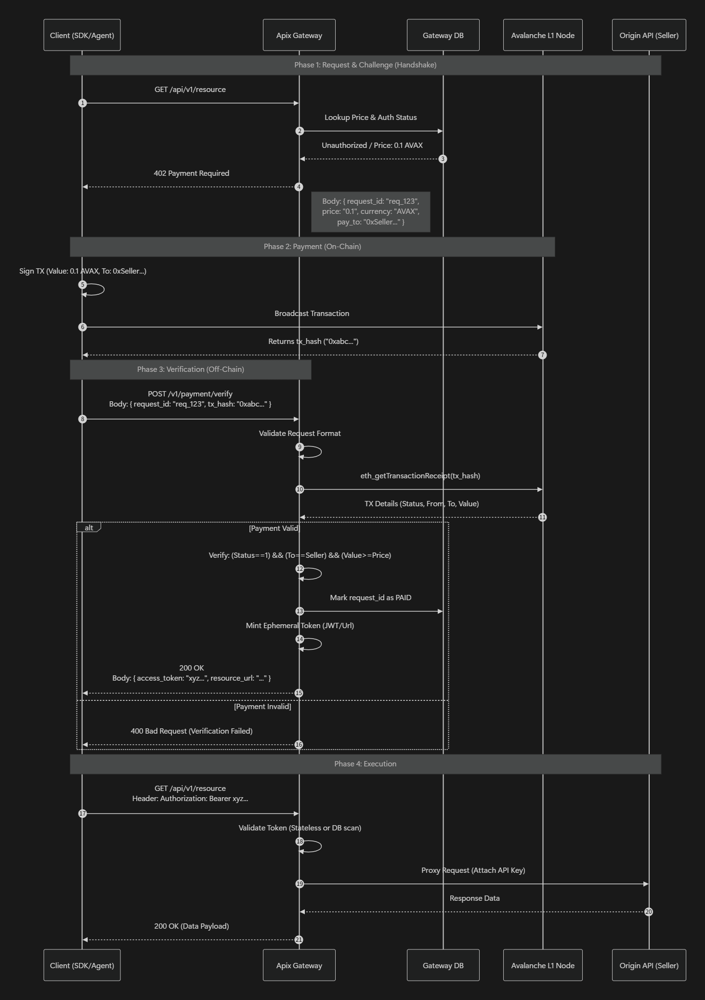
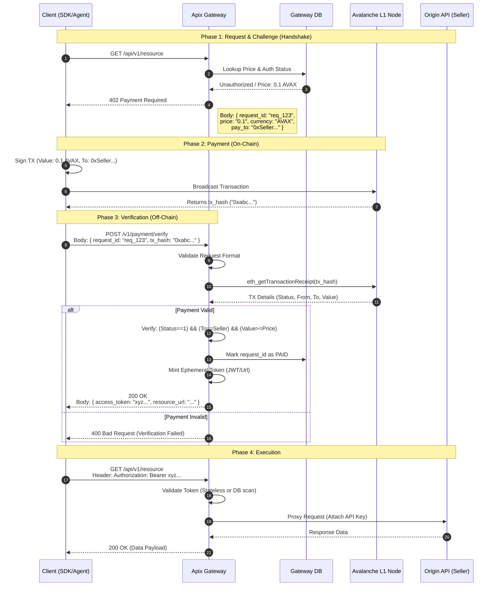

# Apix Technical Specification: x402 Protocol Sequence

| Document ID | APIX-SPEC-001 |
| :--- | :--- |
| **Title** | x402 Micropayment Protocol Sequence Diagram |
| **Version** | 1.0.0 |
| **Status** | **Release** |
| **Author** | Apix Architecture Team |
| **Scope** | Client SDK, Apix Gateway, Avalanche L1 Node, Origin API |

## 1. Overview

This document defines the normative sequence flow for the **x402 (Payment Required)** protocol. It serves as the primary implementation guide for Backend, Frontend, and Blockchain engineers. It details the synchronous interactions required to secure, pay for, and consume API resources using the Avalanche L1 blockchain.

## 2. Actors & Components

*   **Client (SDK/Agent):** The interaction initiator. Responsible for handling `402` challenges, managing the wallet, and signing transactions.
*   **Apix Gateway:** The trusted middleware/proxy. It manages session states, acting as the **Verifier** of on-chain transactions and gatekeeper for the Origin API.
*   **Gateway DB:** Stores session states, `request_id` mapping, and listing metadata (Pricing, Pay-to Address).
*   **Avalanche L1 Node:** The external blockchain RPC node (e.g., C-Chain). Used to broadcast and verify payment transactions.
*   **Origin API:** The actual resource provider (Seller's Server) protected by the Gateway.

## 3. Sequence Diagram

The following diagram illustrates the "Pay-per-Call" lifecycle.



## 4. Key Implementation Details

### 4.1. The "402" Challenge Payload
When the Gateway returns a `402`, the body **MUST** follow this JSON schema to allow SDKs to auto-construct transactions:

```json
{
  "error": {
    "code": 402,
    "message": "Payment Required",
    "details": {
      "request_id": "req_550e8400-e29b",
      "chain_id": 43114,
      "payment_info": {
        "currency": "AVAX",
        "amount": "0.100000000000000000",
        "recipient": "0x71C7656EC7ab88b098defB751B7401B5f6d8976F"
      }
    }
  }
}
```

### 4.2. Verification Logic
The Gateway's verification logic is the security core. It must **independently** query the RPC node.
*   **Safety Check:** Ensure `tx_hash` is unique and has not been used for another `request_id`.
*   **Zero-Conf vs. Confirmation:**
    *   *Default:* Wait for `latest` block (approx 1-2s confirmation).
    *   *Optimistic (Optional):* For amounts < $0.10, accept existence in `pending` block (Mempool).

### 4.3. Access Token Strategy
Upon successful verification, the Gateway issues an **Ephemeral Access Token**.
*   **Type:** Short-lived JWT (JSON Web Token) or detailed Redirect URL.
*   **TTL (Time-To-Live):** Recommended 60 seconds (just enough to retry the request).
*   **Scope:** Strictly limited to the original `request_id`'s target resource.
