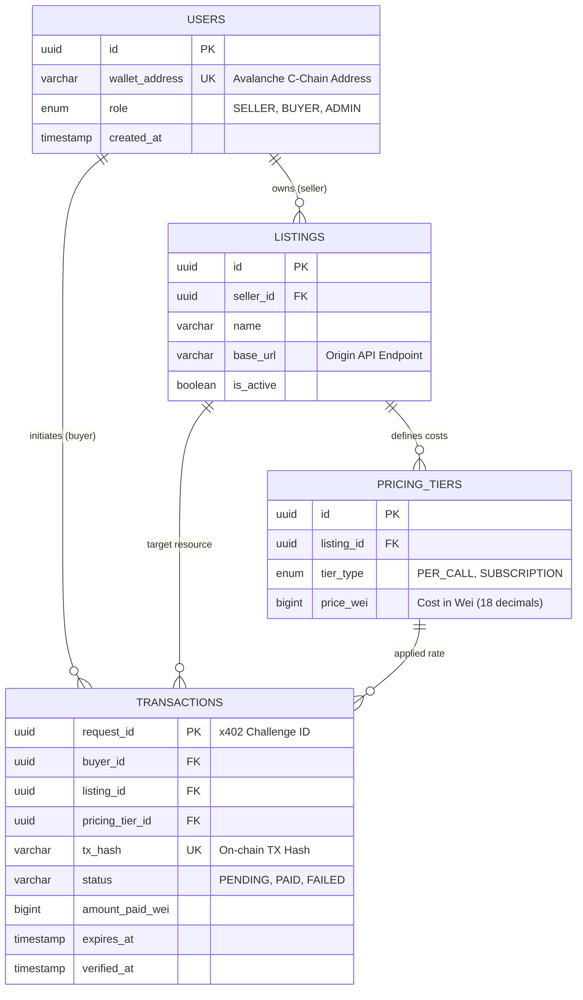

# Apix Technical Specification: Database Schema

| Document ID | APIX-SPEC-003 |
| :--- | :--- |
| **Title** | Database Schema & Entity Relationships (ERD) |
| **Version** | 1.0.0 |
| **Status** | **Release** |
| **Target DB** | PostgreSQL 15+ |
| **Scope** | Users, Listings, Pricing, x402 Transactions |

## 1. Overview

This document defines the persistent data structures required for the **Apix** platform. It serves as the source of truth for backend implementation, ensuring data integrity for user profiles, API marketplace listings, and the critical **x402 payment lifecycle**.

The schema is designed to support:
*   **Wallet-based Authentication:** Users are identified by their Avalanche wallet addresses.
*   **Flexible Pricing:** Support for future pricing models (e.g., subscription vs. per-call) via a dedicated pricing tier table.
*   **x402 Protocol State:** Accurate tracking of payment requests from `402 Payment Required` triggers to on-chain confirmation.

## 2. Entity Relationship Diagram (ERD)

The following Mermaid diagram outlines the core entities and their relationships.



## 3. Schema Details

### 3.1. Users (`users`)
Stores all platform participants. Authentication is handled via wallet signatures, so no passwords are stored.

| Column | Type | Constraints | Description |
| :--- | :--- | :--- | :--- |
| `id` | UUID | PK, Default: v4 | Internal system ID. |
| `wallet_address` | VARCHAR(42) | UNIQUE, NOT NULL | Lowercase normalized Avalanche address. |
| `role` | ENUM | DEFAULT 'BUYER' | Role-based access control (`SELLER`, `BUYER`, `ADMIN`). |
| `created_at` | TIMESTAMPTZ | DEFAULT NOW() | Registration timestamp. |

### 3.2. Listings (`listings`)
Represents the API services registered by sellers for monetization.

| Column | Type | Constraints | Description |
| :--- | :--- | :--- | :--- |
| `id` | UUID | PK, Default: v4 | Unique Listing ID. |
| `seller_id` | UUID | FK -> `users.id` | Owner of the listing. |
| `name` | VARCHAR(100) | NOT NULL | Display name of the API service. |
| `base_url` | TEXT | NOT NULL | The actual upstream URL to proxy requests to. |
| `description` | TEXT | NULL | Markdown supported description. |
| `categories` | TEXT[] | NULL | Array of category tags for discovery. |
| `is_active` | BOOLEAN | DEFAULT TRUE | Soft delete/pause toggle. |

### 3.3. Pricing Tiers (`pricing_tiers`)
Decouples pricing from listings to allow multiple billing options (e.g., standard vs. premium) in the future.

| Column | Type | Constraints | Description |
| :--- | :--- | :--- | :--- |
| `id` | UUID | PK, Default: v4 | Unique Tier ID. |
| `listing_id` | UUID | FK -> `listings.id` | Parent listing. |
| `tier_type` | VARCHAR(20) | CHECK IN ('PER_CALL') | Currently supports `PER_CALL`. |
| `price_wei` | NUMERIC(78) | NOT NULL | Price in Wei. stored as high-precision numeric or string. |
| `call_limit` | INTEGER | DEFAULT 1 | Number of calls allowed per payment (default 1). |

### 3.4. Transactions (`transactions`)
The ledger for the **x402 Protocol**. Tracks the lifecycle of a payment challenge.

| Column | Type | Constraints | Description |
| :--- | :--- | :--- | :--- |
| `request_id` | UUID | PK | The UUID generated during the 402 response. |
| `listing_id` | UUID | FK -> `listings.id` | Target API. |
| `buyer_id` | UUID | FK -> `users.id` | (Nullable) The user paying (if authenticated). |
| `pricing_tier_id`| UUID | FK -> `pricing_tiers.id`| The applied pricing model. |
| `tx_hash` | VARCHAR(66) | UNIQUE, NULL | The TX hash submitted by the client for verification. |
| `status` | ENUM | DEFAULT 'PENDING' | `PENDING` -> `PAID` (Verified) or `FAILED`/`EXPIRED`. |
| `amount_paid` | NUMERIC(78) | NULL | Actual value verified on-chain (Wei). |
| `created_at` | TIMESTAMPTZ | DEFAULT NOW() | When the 402 challenge was issued. |
| `expires_at` | TIMESTAMPTZ | NOT NULL | Expiration time for the challenge (e.g., +15 mins). |
| `verified_at` | TIMESTAMPTZ | NULL | Time of successful blockchain verification. |

---

## 4. DDL Script (PostgreSQL)

Use the following SQL to initialize the database schema. It utilizes `uuid-ossp` for ID generation.

```sql
-- Enable UUID extension
CREATE EXTENSION IF NOT EXISTS "uuid-ossp";

-- Enum Types
CREATE TYPE user_role AS ENUM ('SELLER', 'BUYER', 'ADMIN');
CREATE TYPE tx_status AS ENUM ('PENDING', 'PAID', 'FAILED', 'EXPIRED');

-- 1. Users Table
CREATE TABLE IF NOT EXISTS users (
    id UUID PRIMARY KEY DEFAULT uuid_generate_v4(),
    wallet_address VARCHAR(42) UNIQUE NOT NULL,
    role user_role NOT NULL DEFAULT 'BUYER',
    created_at TIMESTAMPTZ DEFAULT NOW()
);

-- 2. Listings Table
CREATE TABLE IF NOT EXISTS listings (
    id UUID PRIMARY KEY DEFAULT uuid_generate_v4(),
    seller_id UUID NOT NULL REFERENCES users(id) ON DELETE CASCADE,
    name VARCHAR(100) NOT NULL,
    base_url TEXT NOT NULL,
    description TEXT,
    categories TEXT[],
    is_active BOOLEAN DEFAULT TRUE,
    created_at TIMESTAMPTZ DEFAULT NOW()
);

-- 3. Pricing Tiers Table
CREATE TABLE IF NOT EXISTS pricing_tiers (
    id UUID PRIMARY KEY DEFAULT uuid_generate_v4(),
    listing_id UUID NOT NULL REFERENCES listings(id) ON DELETE CASCADE,
    tier_type VARCHAR(20) NOT NULL DEFAULT 'PER_CALL',
    price_wei NUMERIC(78, 0) NOT NULL, -- Numeric to handle uint256 range safe enough for prices
    call_limit INTEGER DEFAULT 1
);

-- 4. Transactions Table (x402 Ledger)
CREATE TABLE IF NOT EXISTS transactions (
    request_id UUID PRIMARY KEY DEFAULT uuid_generate_v4(),
    listing_id UUID NOT NULL REFERENCES listings(id),
    buyer_id UUID REFERENCES users(id) ON DELETE SET NULL,
    pricing_tier_id UUID REFERENCES pricing_tiers(id),
    tx_hash VARCHAR(66) UNIQUE,
    status tx_status NOT NULL DEFAULT 'PENDING',
    amount_paid NUMERIC(78, 0),
    created_at TIMESTAMPTZ DEFAULT NOW(),
    expires_at TIMESTAMPTZ NOT NULL,
    verified_at TIMESTAMPTZ
);

-- Indexes for Performance
CREATE INDEX idx_users_wallet_address ON users(wallet_address);
CREATE INDEX idx_listings_seller_id ON listings(seller_id);
CREATE INDEX idx_transactions_status ON transactions(status);
CREATE INDEX idx_transactions_tx_hash ON transactions(tx_hash);
CREATE INDEX idx_transactions_listing_id ON transactions(listing_id);
```
