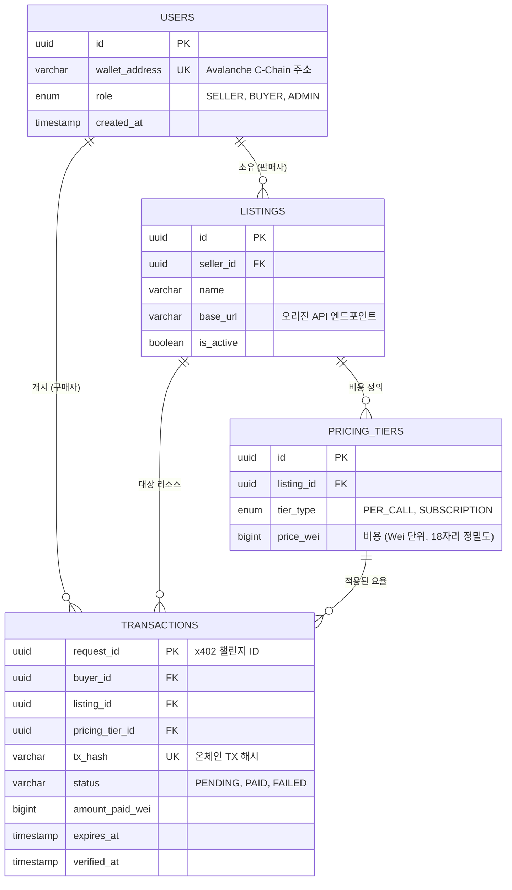

# Apix 기술 명세서: 데이터베이스 스키마

| 문서 ID | APIX-SPEC-003 |
| :--- | :--- |
| **제목** | 테이터베이스 스키마 및 엔티티 관계도 (ERD) |
| **버전** | 1.0.0 |
| **상태** | **Release** |
| **타겟 DB** | PostgreSQL 15+ |
| **범위** | 사용자, 리스팅, 가격 정책, x402 트랜잭션 |

## 1. 개요 (Overview)

이 문서는 **Apix** 플랫폼에 필요한 영구적인 데이터 구조를 정의합니다. 백엔드 구현의 기준(Source of Truth)이 되며, 사용자 프로필, API 마켓플레이스 리스팅, 그리고 핵심적인 **x402 결제 생명주기**의 데이터 무결성을 보장합니다.

이 스키마는 다음을 지원하도록 설계되었습니다:
*   **지갑 기반 인증 (Wallet-based Authentication):** 사용자는 Avalanche 지갑 주소로 식별됩니다.
*   **유연한 가격 정책 (Flexible Pricing):** 별도의 가격 티어(Pricing Tier) 테이블을 통해 향후 확장 가능한 가격 모델(예: 구독 vs 건당 과금)을 지원합니다.
*   **x402 프로토콜 상태 (x402 Protocol State):** `402 Payment Required` 트리거 시점부터 온체인 확정까지의 결제 요청 상태를 정확히 추적합니다.

## 2. 엔티티 관계도 (ERD)

다음 Mermaid 다이어그램은 핵심 엔티티와 그 관계를 보여줍니다.



## 3. 스키마 상세 (Schema Details)

### 3.1. Users (`users`)
플랫폼의 모든 참여자를 저장합니다. 인증은 지갑 서명을 통해 처리되므로 비밀번호는 저장하지 않습니다.

| 컬럼 | 타입 | 제약조건 | 설명 |
| :--- | :--- | :--- | :--- |
| `id` | UUID | PK, 기본값: v4 | 내부 시스템 ID. |
| `wallet_address` | VARCHAR(42) | UNIQUE, NOT NULL | 소문자로 정규화된 Avalanche 주소. |
| `role` | ENUM | DEFAULT 'BUYER' | 역할 기반 접근 제어 (`SELLER`, `BUYER`, `ADMIN`). |
| `created_at` | TIMESTAMPTZ | DEFAULT NOW() | 가입 일시. |

### 3.2. Listings (`listings`)
판매자가 수익화를 위해 등록한 API 서비스를 나타냅니다.

| 컬럼 | 타입 | 제약조건 | 설명 |
| :--- | :--- | :--- | :--- |
| `id` | UUID | PK, 기본값: v4 | 고유 리스팅 ID. |
| `seller_id` | UUID | FK -> `users.id` | 리스팅 소유자. |
| `name` | VARCHAR(100) | NOT NULL | API 서비스 표시 이름. |
| `base_url` | TEXT | NOT NULL | 요청을 프록시할 실제 업스트림 URL. |
| `description` | TEXT | NULL | 마크다운을 지원하는 상세 설명. |
| `categories` | TEXT[] | NULL | 검색을 위한 카테고리 태그 배열. |
| `is_active` | BOOLEAN | DEFAULT TRUE | 소프트 삭제/일시 중지 토글. |

### 3.3. Pricing Tiers (`pricing_tiers`)
가격을 리스팅과 분리하여 향후 다중 과금 옵션(예: 일반 vs 프리미엄)을 허용합니다.

| 컬럼 | 타입 | 제약조건 | 설명 |
| :--- | :--- | :--- | :--- |
| `id` | UUID | PK, 기본값: v4 | 고유 티어 ID. |
| `listing_id` | UUID | FK -> `listings.id` | 상위 리스팅. |
| `tier_type` | VARCHAR(20) | CHECK IN ('PER_CALL') | 현재 `PER_CALL`(건당 과금) 지원. |
| `price_wei` | NUMERIC(78) | NOT NULL | Wei 단위 가격. 높은 정밀도의 숫자나 문자열로 저장. |
| `call_limit` | INTEGER | DEFAULT 1 | 결제 1회당 허용 호출 횟수 (기본값 1). |

### 3.4. Transactions (`transactions`)
**x402 프로토콜**의 원장(Ledger)입니다. 결제 챌린지의 생명주기를 추적합니다.

| 컬럼 | 타입 | 제약조건 | 설명 |
| :--- | :--- | :--- | :--- |
| `request_id` | UUID | PK | 402 응답 시 생성된 UUID. |
| `listing_id` | UUID | FK -> `listings.id` | 대상 API. |
| `buyer_id` | UUID | FK -> `users.id` | (Nullable) 결제한 사용자 (로그인 시). |
| `pricing_tier_id`| UUID | FK -> `pricing_tiers.id`| 적용된 가격 모델. |
| `tx_hash` | VARCHAR(66) | UNIQUE, NULL | 검증을 위해 클라이언트가 제출한 TX 해시. |
| `status` | ENUM | DEFAULT 'PENDING' | `PENDING` -> `PAID` (검증됨) 또는 `FAILED`/`EXPIRED`. |
| `amount_paid` | NUMERIC(78) | NULL | 온체인에서 확인된 실제 금액 (Wei). |
| `created_at` | TIMESTAMPTZ | DEFAULT NOW() | 402 챌린지 발급 시점. |
| `expires_at` | TIMESTAMPTZ | NOT NULL | 챌린지 만료 시간 (예: +15분). |
| `verified_at` | TIMESTAMPTZ | NULL | 블록체인 검증 성공 시점. |

---

## 4. DDL 스크립트 (PostgreSQL)

아래 SQL을 사용하여 데이터베이스 스키마를 초기화하십시오. ID 생성을 위해 `uuid-ossp`를 사용합니다.

```sql
-- UUID 확장 기능 활성화
CREATE EXTENSION IF NOT EXISTS "uuid-ossp";

-- Enum 타입 정의
CREATE TYPE user_role AS ENUM ('SELLER', 'BUYER', 'ADMIN');
CREATE TYPE tx_status AS ENUM ('PENDING', 'PAID', 'FAILED', 'EXPIRED');

-- 1. Users 테이블
CREATE TABLE IF NOT EXISTS users (
    id UUID PRIMARY KEY DEFAULT uuid_generate_v4(),
    wallet_address VARCHAR(42) UNIQUE NOT NULL,
    role user_role NOT NULL DEFAULT 'BUYER',
    created_at TIMESTAMPTZ DEFAULT NOW()
);

-- 2. Listings 테이블
CREATE TABLE IF NOT EXISTS listings (
    id UUID PRIMARY KEY DEFAULT uuid_generate_v4(),
    seller_id UUID NOT NULL REFERENCES users(id) ON DELETE CASCADE,
    name VARCHAR(100) NOT NULL,
    base_url TEXT NOT NULL,
    description TEXT,
    categories TEXT[],
    is_active BOOLEAN DEFAULT TRUE,
    created_at TIMESTAMPTZ DEFAULT NOW()
);

-- 3. Pricing Tiers 테이블
CREATE TABLE IF NOT EXISTS pricing_tiers (
    id UUID PRIMARY KEY DEFAULT uuid_generate_v4(),
    listing_id UUID NOT NULL REFERENCES listings(id) ON DELETE CASCADE,
    tier_type VARCHAR(20) NOT NULL DEFAULT 'PER_CALL',
    price_wei NUMERIC(78, 0) NOT NULL, -- uint256 범위 처리를 위한 Numeric
    call_limit INTEGER DEFAULT 1
);

-- 4. Transactions 테이블 (x402 원장)
CREATE TABLE IF NOT EXISTS transactions (
    request_id UUID PRIMARY KEY DEFAULT uuid_generate_v4(),
    listing_id UUID NOT NULL REFERENCES listings(id),
    buyer_id UUID REFERENCES users(id) ON DELETE SET NULL,
    pricing_tier_id UUID REFERENCES pricing_tiers(id),
    tx_hash VARCHAR(66) UNIQUE,
    status tx_status NOT NULL DEFAULT 'PENDING',
    amount_paid NUMERIC(78, 0),
    created_at TIMESTAMPTZ DEFAULT NOW(),
    expires_at TIMESTAMPTZ NOT NULL,
    verified_at TIMESTAMPTZ
);

-- 성능을 위한 인덱스
CREATE INDEX idx_users_wallet_address ON users(wallet_address);
CREATE INDEX idx_listings_seller_id ON listings(seller_id);
CREATE INDEX idx_transactions_status ON transactions(status);
CREATE INDEX idx_transactions_tx_hash ON transactions(tx_hash);
CREATE INDEX idx_transactions_listing_id ON transactions(listing_id);
```
