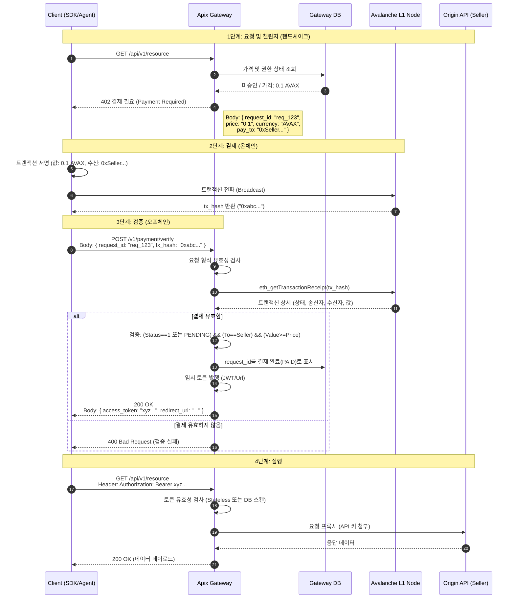

# Apix 기술 명세서: x402 프로토콜 시퀀스

| 문서 ID | APIX-SPEC-001 |
| :--- | :--- |
| **제목** | x402 마이크로페이먼트 프로토콜 시퀀스 다이어그램 |
| **버전** | 1.0.0 |
| **상태** | **Release** |
| **작성자** | Apix 아키텍처 팀 |
| **범위** | 클라이언트 SDK, Apix 게이트웨이, Avalanche L1 노드, 오리진 API |

## 1. 개요 (Overview)

이 문서는 **x402 (결제 필요)** 프로토콜의 표준 시퀀스 흐름을 정의합니다. 이는 백엔드, 프론트엔드, 블록체인 엔지니어를 위한 주 구현 가이드 역할을 합니다. Avalanche L1 블록체인을 사용하여 API 리소스를 보호하고, 결제하며, 소비하는 데 필요한 동기식 상호 작용을 상세히 설명합니다.

## 2. 액터 및 컴포넌트 (Actors & Components)

*   **Client (SDK/Agent):** 상호 작용 시작자. `402` 챌린지를 처리하고, 지갑을 관리하며, 트랜잭션에 서명하는 역할을 담당합니다.
*   **Apix Gateway:** 신뢰할 수 있는 미들웨어/프록시. 세션 상태를 관리하며, 온체인 트랜잭션의 **검증자(Verifier)**이자 오리진 API의 문지기 역할을 합니다.
*   **Gateway DB:** 세션 상태, `request_id` 매핑, 리스팅 메타데이터(가격, 수신 주소)를 저장합니다.
*   **Avalanche L1 Node:** 외부 블록체인 RPC 노드 (예: C-Chain). 결제 트랜잭션을 전파하고 검증하는 데 사용됩니다.
*   **Origin API:** 게이트웨이 뒤에서 보호받는 실제 리소스 제공자(판매자 서버)입니다.

## 3. 시퀀스 다이어그램 (Sequence Diagram)

다음 다이어그램은 "건당 지불(Pay-per-Call)" 생명주기를 보여줍니다.



## 4. 핵심 구현 세부사항 (Key Implementation Details)

### 4.1. "402" 챌린지 페이로드
게이트웨이가 `402`를 반환할 때, SDK가 트랜잭션을 자동으로 생성할 수 있도록 본문은 **반드시** 아래 JSON 스키마를 따라야 합니다.

```json
{
  "error": {
    "code": 402,
    "message": "Payment Required",
    "details": {
      "request_id": "req_550e8400-e29b",
      "chain_id": 43114,
      "payment_info": {
        "currency": "AVAX",
        "amount": "0.100000000000000000",
        "recipient": "0x71C7656EC7ab88b098defB751B7401B5f6d8976F"
      }
    }
  }
}
```

### 4.2. 검증 로직 (Verification Logic)
게이트웨이의 검증 로직은 보안의 핵심입니다. RPC 노드를 통해 **독립적으로** 조회해야 합니다.
*   **중복 체크:** `tx_hash`가 고유하며 다른 `request_id`에 사용되지 않았는지 확인합니다.
*   **재시도 로직 (Retry):** 트랜잭션 영수증 조회 실패 시 즉시 에러를 반환하지 않고, 지수 백오프(Exponential Backoff)로 몇 차례 재시도하십시오.
*   **Zero-Conf vs. Confirmation:**
    *   *기본:* `latest` 블록을 기다립니다 (약 1-2초 확정).
    *   *낙관적 (선택 사항):* $0.10 미만의 소액인 경우, `pending` 블록(멤풀)에 존재하는 것만으로도 승인할 수 있습니다.

### 4.3. 액세스 토큰 전략 (Access Token Strategy)
검증이 성공하면 게이트웨이는 **임시 액세스 토큰(Ephemeral Access Token)**을 발행합니다.
*   **유형:** 단기 만료 JWT (JSON Web Token) 또는 상세 리디렉션 URL.
*   **TTL (수명):** 권장 60초 (요청을 재시도하기에 딱 충분한 시간).
*   **범위:** 원래 요청된 `request_id`의 대상 리소스로 엄격히 제한됩니다.
