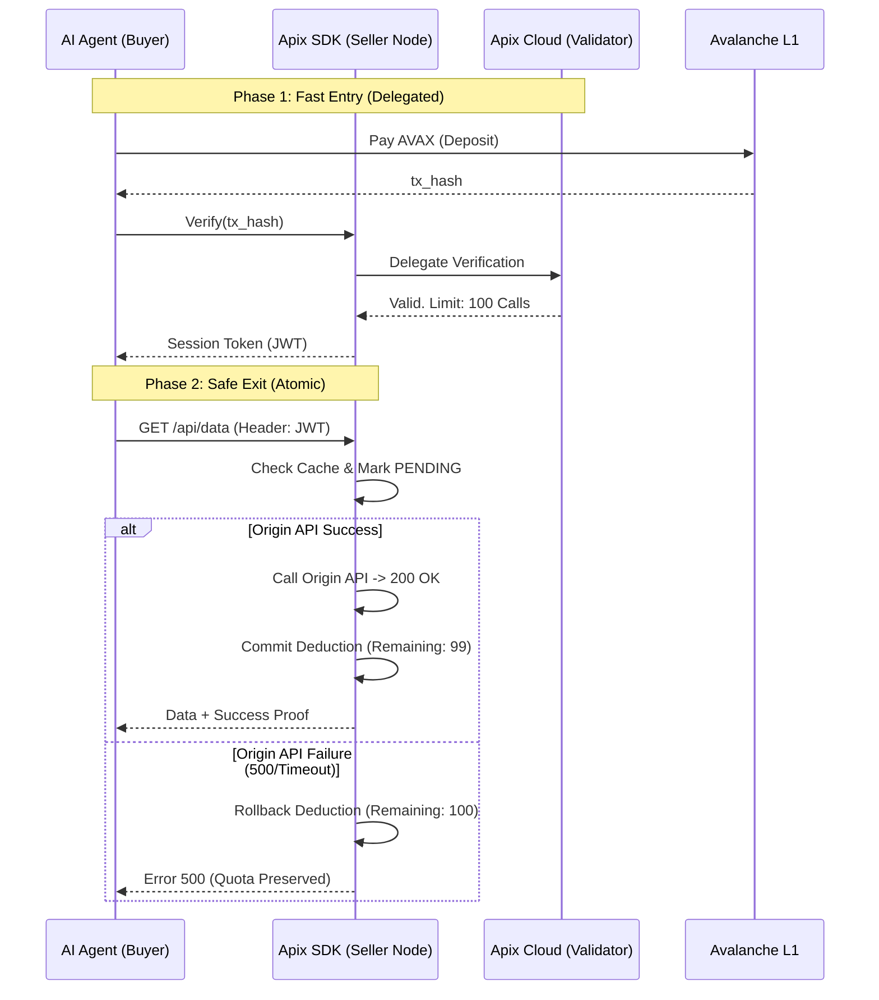

# Apix Middleware SDK: Pivoting Plan (Consolidated)

| Document ID | APIX-PLAN-2026-001 |
| :--- | :--- |
| **Project Name** | Apix Middleware SDK (Pivot Strategy) |
| **Version** | 1.0.0 (Synthesized) |
| **Date** | 2026-02-03 |
| **Status** | **Actionable / Development Ready** |

---

## 1. Executive Summary: The "Stripe for AI Agents"

Apix is pivoting from a centralized API marketplace to a **decentralized payment middleware SDK**.
Our mission is to enable any API provider to monetize their data via the **x402 protocol** on Avalanche L1 with zero friction, combining the **Speed of Web2** with the **Trust of Web3**.

**Core Value Proposition:**
*   **For Sellers:** Three lines of code to monetize any API. No platform lock-in.
*   **For Buyers (AI Agents):** Millisecond-level access to global data without KYC or credit cards.

## 2. Core Concept: Verifiable Atomic Session (VAS)

To resolve the conflict between blockchain latency and API performance, we introduce the **Verifiable Atomic Session (VAS)**:

1.  **Fast Entry (Performance):** **Delegated Verification**. The SDK delegates verification to a stateless facilitator (Apix Cloud), utilizing JWT caching for subsequent requests to achieve $\mu$s-level latency.
2.  **Safe Exit (Trust):** **Conditional Deduction**. Users pay upfront, but the session quota is only committed upon successful HTTP 200 responses. If the server fails (5xx), the quota is preserved (Atomic Deduction).

## 3. Architecture: "Thin SDK, Fat Cloud"

| Component | Role | Tech Stack |
| :--- | :--- | :--- |
| **Apix SDK** | Traffic Interceptor & Policy Enforcer. Installs on Seller Server. | Node.js/Go/Python, Stateless |
| **Apix Cloud** | Blockchain Verification, Nonce Management, Replay Protection. | Golang, AWS/GCP, Persistent WebSocket to RPC |
| **Smart Contract** | Settlement, Event Logging (`ApixPaymentRouter`). | Solidity (Avalanche L1) |

## 4. Key Development Priorities (Integrated)

Based on technical feasibility and market differentiation, the following features are prioritized:

### Priority 1: Delegated Verification (The Gateway)
*   **Goal:** Remove blockchain latency from the critical path using an external facilitator.
*   **Implementation:**
    *   SDK sends `tx_hash` to Apix Cloud Validator.
    *   Cloud checks on-chain validity and returns a signed session approval.
    *   **Tech constraints:** Use standard ethers.js (v6.16.0+) for signature verification.
    *   **Security:** Strong Replay Attack protection (binding `nonce`, `request_id`, and seller address).

### Priority 2: High-Speed Session Caching (The Engine)
*   **Goal:** Enable high-frequency API calls typical of AI agents.
*   **Implementation:**
    *   Upon verification, issue a short-lived **JWT (Session Token)**.
    *   SDK uses in-memory caching (Redis/Map) to validate the JWT for subsequent calls in microseconds.
    *   **Target:** < 1ms overhead per request.

### Priority 3: Reliability & Atomic Deduction (The Trust)
*   **Goal:** Guarantee "No Data, No Pay" without complex escrow smart contracts for every call.
*   **Implementation:**
    *   **Request Start:** Mark session usage as `PENDING`.
    *   **Success (200):** Commit deduction.
    *   **Failure (5xx):** Rollback deduction (Quota returned).
    *   **Note:** Escrow can be added as an optional module for high-value transactions (following x402 V2 proposals).

### Priority 4: Security & Dispute Resolution
*   **Response Signing:** SDK signs response body hashes (EIP-712) so Agents can prove they received specific data.
*   **Audit Logging:** Encrypted logs of `tx_hash` and response status for dispute resolution.

## 5. Sequence Diagram (VAS Flow)

## 6. MVP Roadmap (4-6 Weeks)

1.  **Weeks 1-2:** Implement **Delegated Verification** with Apix Cloud mock.
2.  **Weeks 3-4:** Build **JWT Session Caching** and Basic **Atomic Deduction** logic.
3.  **Weeks 5-6:** Integrate **Avalanche L1** event listening and **Replay Protection**.
