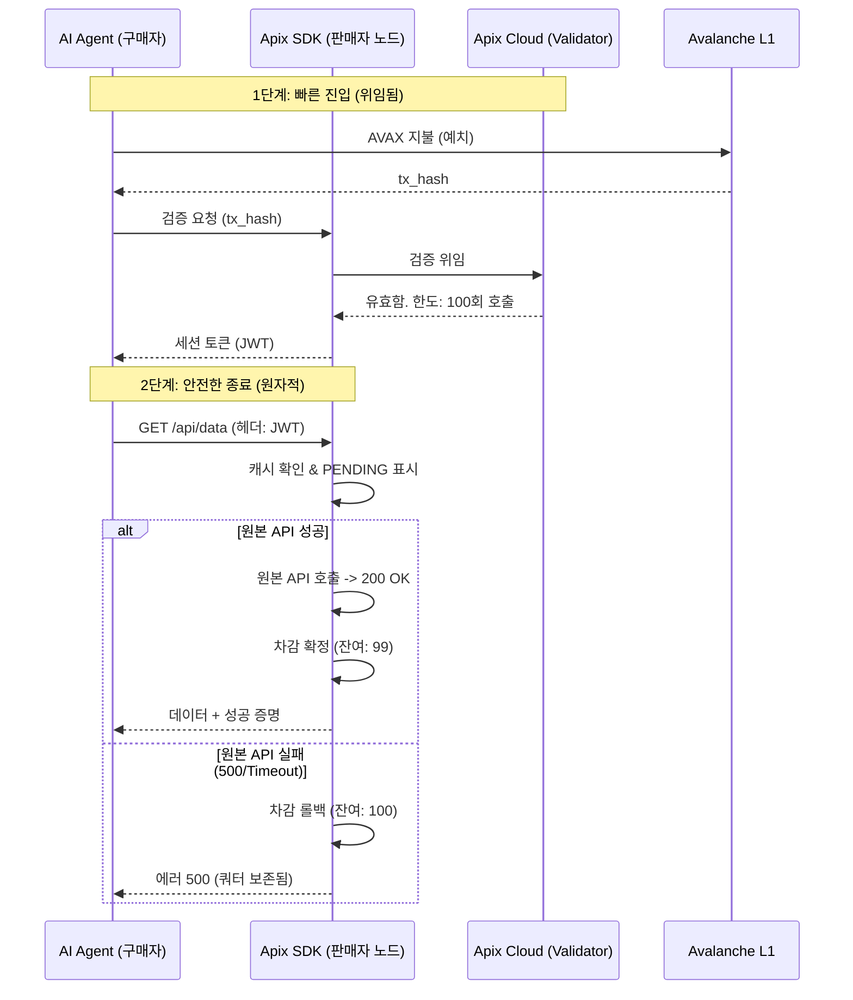

# Apix 미들웨어 SDK: 피벗 계획 (통합본)

| 문서 ID | APIX-PLAN-2026-001 |
| :--- | :--- |
| **프로젝트명** | Apix Middleware SDK (Pivot Strategy) |
| **버전** | 1.0.0 (Synthesized) |
| **날짜** | 2026-02-03 |
| **상태** | **실행 가능 / 개발 준비 완료** |

---

## 1. 개요: "AI 에이전트를 위한 Stripe"

Apix는 중앙화된 API 마켓플레이스에서 **탈중앙화 결제 미들웨어 SDK**로 피벗(pivot)합니다.
우리의 미션은 모든 API 제공자가 **Avalanche L1**의 **x402 프로토콜**을 통해 마찰 없이 데이터를 수익화할 수 있도록 지원하는 것이며, **Web2의 속도**와 **Web3의 신뢰**를 결합하는 것입니다.

**핵심 가치 제안:**
*   **판매자용:** 단 3줄의 코드로 모든 API를 수익화. 플랫폼 종속성(Lock-in) 없음.
*   **구매자용 (AI 에이전트):** KYC나 신용카드 없이 전 세계 데이터에 밀리초(ms) 단위로 접근 가능.

## 2. 핵심 개념: 검증 가능한 원자적 세션 (VAS)

블록체인의 지연 시간(Latency)과 API 성능 간의 충돌을 해결하기 위해 **검증 가능한 원자적 세션(Verifiable Atomic Session, VAS)**을 도입합니다:

1.  **빠른 진입 (성능):** **위임된 검증 (Delegated Verification)**. SDK는 검증을 무상태(stateless) 중개자(Apix Cloud)에 위임하고, 후속 요청에 대해 JWT 캐싱을 활용하여 마이크로초($\mu$s) 수준의 지연 시간을 달성합니다.
2.  **안전한 종료 (신뢰):** **조건부 차감 (Conditional Deduction)**. 사용자는 선불로 지불하지만, 세션 쿼터는 HTTP 200 응답이 성공했을 때만 확정(commit)됩니다. 서버 오류(5xx) 발생 시 쿼터는 보존됩니다(원자적 차감).

## 3. 아키텍처: "Thin SDK, Fat Cloud"

| 구성 요소 | 역할 | 기술 스택 |
| :--- | :--- | :--- |
| **Apix SDK** | 트래픽 인터셉터 및 정책 집행기. 판매자 서버에 설치. | Node.js/Go/Python, Stateless |
| **Apix Cloud** | 블록체인 검증, Nonce 관리, 재생(Replay) 방지. | Golang, AWS/GCP, RPC에 지속적 WebSocket 연결 |
| **스마트 컨트랙트** | 정산, 이벤트 로깅 (`ApixPaymentRouter`). | Solidity (Avalanche L1) |

## 4. 주요 개발 우선순위 (통합)

기술적 타당성과 시장 차별성을 바탕으로 다음 기능들이 우선순위로 지정되었습니다:

### 우선순위 1: 위임된 검증 (게이트웨이)
*   **목표:** 블록체인 지연 시간을 핵심 경로(critical path)에서 제거하여 외부 중개자를 활용.
*   **구현:**
    *   SDK가 `tx_hash`를 Apix Cloud Validator로 전송.
    *   Cloud는 온체인 유효성을 확인하고 서명된 세션 승인을 반환.
    *   **기술 제약:** 서명 검증을 위해 표준 ethers.js (v6.16.0+) 사용.
    *   **보안:** 강력한 재생 공격(Replay Attack) 방지 (`nonce`, `request_id`, 판매자 주소 바인딩).

### 우선순위 2: 고속 세션 캐싱 (엔진)
*   **목표:** AI 에이전트의 특징인 고빈도 API 호출 지원.
*   **구현:**
    *   검증 성공 시, 단기 **JWT (세션 토큰)** 발급.
    *   SDK는 메모리 내 캐싱(Redis/Map)을 사용하여 후속 호출에 대해 마이크로초 단위로 JWT 검증.
    *   **목표:** 요청당 오버헤드 < 1ms.

### 우선순위 3: 신뢰성 및 원자적 차감 (신뢰)
*   **목표:** 모든 호출에 복잡한 에스크로 컨트랙트 없이 "데이터 없이는 지불 없음(No Data, No Pay)" 보장.
*   **구현:**
    *   **요청 시작:** 세션 사용을 `PENDING`으로 표시.
    *   **성공 (200):** 차감 확정(Commit).
    *   **실패 (5xx):** 차감 롤백 (쿼터 반환).
    *   **참고:** 고액 거래의 경우 에스크로를 선택적 모듈로 추가 가능 (x402 V2 제안 따름).

### 우선순위 4: 보안 및 분쟁 해결
*   **응답 서명:** SDK가 응답 본문 해시에 서명(EIP-712)하여 에이전트가 특정 데이터를 수신했음을 증명할 수 있음.
*   **감사 로깅:** 분쟁 해결을 위해 `tx_hash`와 응답 상태에 대한 암호화된 로그 저장.

## 5. 시퀀스 다이어그램 (VAS 흐름)

## 6. MVP 로드맵 (4-6주)

1.  **1-2주차:** Apix Cloud 모의(mock) 서버와 **위임된 검증** 구현.
2.  **3-4주차:** **JWT 세션 캐싱** 및 기본 **원자적 차감** 로직 구축.
3.  **5-6주차:** **Avalanche L1** 이벤트 리스닝 및 **재생 방지(Replay Protection)** 통합.
