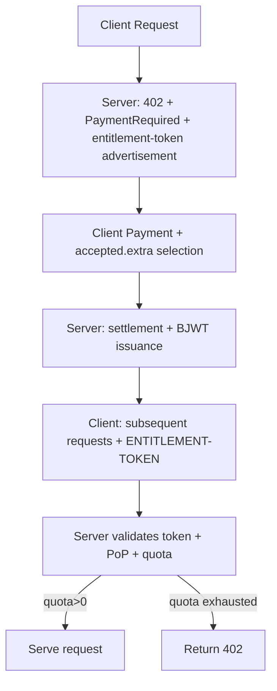

# ACP-402: BJWT Entitlement Token for Post-Payment Quota Access

## Proposal purpose

This ACP proposes an x402 extension for APIX so one settled payment can authorize a bounded number of subsequent API calls. The extension is additive: per-request payment remains supported as the baseline, while `ENTITLEMENT-TOKEN` enables quota-style commercial products.

Korean version: [apiX-402-bjwt-entitlement-token-proposal_KOR.md](/home/jylee/omx/APIX/docs/proposals/apiX-402-bjwt-entitlement-token-proposal_KOR.md)

## Proposal snapshot

- **Problem**: Current 402 flow is primarily one-off payment + verification, which makes per-purchase quota-oriented operations difficult.
- **Proposal**: Add `ENTITLEMENT-TOKEN` with BJWT + PoP proof to issue wallet-bound, reusable entitlement credentials after settlement, allowing multiple calls without requiring 402 rebidding each request.
- **Scope**: Optional extension of x402 v2, compatibility-first rollout.
- **Delivery impact**: APIX backend + SDK + frontend demo contract changes + storage/replay control + test hardening.

## Abstract

This proposal defines an **optional x402 extension** that allows a resource server to issue a wallet-bound, reusable entitlement after successful on-chain payment settlement.

The credential, called an **AAT / x402 Entitlement Token**, is a **BJWT (Blockchain JWT)** signed with **EIP-191** by the issuer (the server wallet) and scoped to a payment transaction. Clients include the token with a per-request **PoP proof** signed by the subject wallet, preventing simple bearer-token replay.

The token grants limited-use quota (for example, N calls) without requiring on-chain payment for every request.

## Motivation

x402 provides a strong base for pay-per-request access, but some services require prepaid quotas:

- AI inference or premium API calls where one payment unlocks N requests
- API rate plans with burst access
- Time-boxed access patterns in low-latency Web3 services

This extension standardizes that pattern while keeping x402 compatibility.

## Conformance

The terms **MUST**, **MUST NOT**, **REQUIRED**, **SHOULD**, **SHOULD NOT**, and **MAY** are used with the meanings in RFC 2119.

## Executive summary for decision makers

- **Recommendation**: Adopt this extension as `v1` and keep legacy `Apix` session token as fallback for backward compatibility.
- **Acceptance criteria (MVP)**:
  - Display `entitlement-token` advertisement in the 402 response.
  - Issue BJWT after payment and support entitlement-based re-request with `ENTITLEMENT-TOKEN`.
  - Enforce replay prevention for PoP proof with `(token.jti, proof.jti)`.
  - Return a fresh 402 flow when quota is exhausted.
  - Complete positive/negative E2E test coverage.
- **Out of scope for v1 rollout**:
  - On-chain revocation/force-unlock registry (v1 deferred).
  - Cross-chain key-rotating token distribution for non-message token transport.

## 1. Scope

### In scope

- Extension hooks in x402 v2:
  - `PaymentRequired.extensions["entitlement-token"]`
  - `PaymentPayload.accepted.extra["entitlement-token"]`
  - `SettlementResponse.extensions["entitlement-token"]`
- BJWT token format and verification
- Request-time presentation with PoP proof
- Server-side quota accounting and replay protection

### Out of scope

- Changes to Avalanche consensus
- Mandatory on-chain revocation registry
- A mandatory x402 settlement implementation

## 2. Extension key and versions

- The extension key is `entitlement-token`.
- A version field MUST be present and defined as string integer.
- This draft specifies `version: "1"`.
- Unknown fields SHOULD be ignored to preserve forward compatibility.

## 3. Flow overview

1. Client requests protected resource.
2. Server returns HTTP 402 with `PaymentRequired` and extension advertisement.
3. Client selects a quota pack in `PaymentPayload.accepted.extra["entitlement-token"]` and submits payment.
4. Server verifies settlement and responds with `SettlementResponse` including issued token.
5. Client sends subsequent requests with `ENTITLEMENT-TOKEN` header.
6. Server validates token + proof, increments usage, and serves until quota is exhausted.



## 4. Advertising entitlement support

### 4.1 Object: `EntitlementTokenAdvertisement`

```json
{
  "version": "1",
  "domain": "api.example.com",
  "resource": "https://api.example.com/premium-data",
  "tokenFormat": "bjwt",
  "presentationHeader": "ENTITLEMENT-TOKEN",
  "supportedChains": [{ "chainId": "eip155:43114", "proof": "eip191" }],
  "quota": {
    "unit": "call",
    "packOptions": [
      { "uses": 10, "price": { "network": "eip155:43114", "asset": "0xUSDC...", "amount": "10000" },
      { "uses": 100, "price": { "network": "eip155:43114", "asset": "0xUSDC...", "amount": "90000" }
    ]
  },
  "tokenTtlSeconds": 3600,
  "scope": {
    "methods": ["GET", "POST"],
    "paths": ["/premium-data", "/premium-data/*"]
  },
  "features": {
    "pop": true,
    "idempotentProofs": true
  }
}
```

Requirements:

- `version` MUST be `"1"`.
- `domain` MUST equal the origin expected by the protected resource.
- `resource` SHOULD indicate canonical resource scope.
- `tokenFormat` MUST be `"bjwt"` for v1.
- `presentationHeader` MUST be `"ENTITLEMENT-TOKEN"` for v1.
- `supportedChains[].chainId` MUST be CAIP-2.
- `quota.unit` MUST be `"call"` for v1.
- `quota.packOptions[].uses` MUST be positive integers.
- `quota.packOptions[].price.amount` MUST be decimal string amounts used by x402.
- `tokenTtlSeconds` MUST be a positive integer.
- If `features.pop` is true, server expects proof in request-time presentation.

## 5. Pack selection in payment payload

### 5.1 Object: `EntitlementPackSelection`

```json
{
  "version": "1",
  "pack": { "unit": "call", "uses": 10 }
}
```

This object is sent at:

`PaymentPayload.accepted.extra["entitlement-token"]`

Validation requirements:

- `version` MUST be `"1"`.
- `pack.unit` MUST be `"call"` in v1.
- `pack.uses` MUST match one advertised option.
- Server MUST ensure settlement parameters match the selected pack.

## 6. Issuance in settlement response

### 6.1 Object: `EntitlementTokenIssuance`

```json
{
  "version": "1",
  "token": "<BJWT_STRING>",
  "quota": { "unit": "call", "max": 10 },
  "expiresAt": 1760003600
}
```

Requirements:

- `version` MUST be `"1"`.
- `token` MUST be a valid BJWT.
- `quota.max` MUST equal selected pack uses.
- `expiresAt` MUST equal token `exp`.

## 7. Token format: BJWT

A BJWT is:

`base64url(header) . base64url(payload) . base64url(signature)`

### 7.1 Header

```json
{
  "typ": "x402-entitlement+bjwt",
  "alg": "eip191",
  "ver": "1",
  "kid": "eip155:43114:0xISSUER..."
}
```

Requirements:

- `typ` MUST be `x402-entitlement+bjwt`.
- `alg` MUST be `eip191`.
- `ver` MUST be `"1"`.
- `kid` SHOULD be `{chainId}:{address}`.

### 7.2 Payload

```json
{
  "iss": "eip155:43114:0xISSUER...",
  "sub": "eip155:43114:0xPAYER...",
  "aud": "https://api.example.com",
  "jti": "01H...",
  "iat": 1760000000,
  "exp": 1760003600,
  "scope": {
    "methods": ["GET"],
    "paths": ["/premium-data", "/premium-data/*"]
  },
  "quota": {
    "unit": "call",
    "max": 10
  },
  "x402": {
    "x402Version": 2,
    "network": "eip155:43114",
    "transaction": "0xabc...",
    "payer": "0xPAYER...",
    "payTo": "0xMERCHANT...",
    "asset": "0xUSDC...",
    "amount": "10000",
    "paymentRequirementsHash": "0xREQHASH..."
  }
}
```

Requirements:

- `iss` and `sub` MUST be `{chainId}:{address}`.
- `aud` MUST identify audience (resource origin or identifier).
- `jti` MUST be globally unique.
- `iat`, `exp` MUST be UNIX epoch seconds.
- `quota.unit` MUST be `"call"` in v1.
- `quota.max` MUST be a positive integer.
- `x402.transaction` MUST identify the payment reference used for settlement.

### 7.3 Signature

Let `signingInput = base64url(header) + "." + base64url(payload)` and:

`message = "x402.entitlement-token.v1:" + signingInput`

- Signature MUST be an EIP-191 personal_sign signature by the issuer key for `iss`.
- Verifier MUST recover the signing address and compare with `iss`.
- Signature bytes MUST be encoded as base64url without padding.

### 7.4 Payment requirements binding (recommended)

`x402.paymentRequirementsHash = keccak256(base64(PAYMENT-REQUIRED JSON))`

Servers MAY verify this value when cached request context is available.

## 8. Request-time presentation

### 8.1 Object: `EntitlementPresentation`

```json
{
  "version": "1",
  "token": "<BJWT_STRING>",
  "proof": {
    "type": "eip191",
    "chainId": "eip155:43114",
    "jti": "01J...",
    "iat": 1760000123,
    "htm": "GET",
    "htu": "https://api.example.com/premium-data",
    "ath": "b64url(sha256(token))",
    "requestHash": "0xOPTIONAL",
    "signature": "0x..."
  }
}
```

This is sent as base64(JSON(`EntitlementPresentation`)) in header:

`ENTITLEMENT-TOKEN`.

Requirements:

- `version` MUST be `"1"`.
- `token` MUST be valid BJWT.
- If advertised `features.pop = true`, `proof` MUST be present.

### 8.2 Proof signing

The proof object (excluding `signature`) is canonicalized using RFC 8785 JSON Canonicalization Scheme (JCS) then signed with EIP-191 by the `sub` wallet.

`proofMessage = "x402.entitlement-proof.v1:" + JCS(proofWithoutSignature)`

Verifier requirements:

- `proof.signature` verifies against the `sub` address.
- `proof.ath` equals `base64url(sha256(token))`.
- `proof.htm` equals request method.
- `proof.htu` equals absolute request URL without fragment.
- `(token.jti, proof.jti)` must be unique.
- `proof.iat` must be within allowed clock skew.
- If `requestHash` is present, optional validation MUST match `method + "\n" + path + "\n" + sha256(body)`.

## 9. Server processing algorithm

For requests containing `ENTITLEMENT-TOKEN`:

1. Parse `EntitlementPresentation` from header.
2. Validate token:
   - signature validity
   - `exp` and `nbf`/`iat` checks
   - `aud` matches recipient
   - scope check (`htm`, `htu`)
3. Validate proof:
   - signature by `sub`
   - `ath`, `htu`, `htm` match request context
   - `(token.jti, proof.jti)` uniqueness
4. Check quota:
   - if `used_count >= quota.max`, reject with HTTP 402
5. Atomically increment `used_count` and serve.

Replay behavior:

- Duplicate `(token.jti, proof.jti)` MUST be treated as replay.
- With idempotent support, servers MAY return cached response for duplicate proof and MUST NOT increment usage again.

## 10. Exhaustion and errors

When quota is exhausted:

- Server SHOULD return HTTP 402 with fresh `PaymentRequired` advertising available packs.
- Optional header: `ENTITLEMENT-ERROR`.

Recommended values:

- `invalid_token`
- `invalid_proof`
- `expired`
- `scope_violation`
- `quota_exhausted`
- `replay_detected`

## 11. Backwards compatibility

This is an optional extension. Baseline x402 clients/servers remain operational for per-request payment flows. Endpoints may continue to operate without entitlements, while allowing optional entitlement-based quota for premium flows.

## 12. Relation to prior drafts

This document unifies ideas from previous drafts:

- multi-use payment entitlements,
- token issuance after on-chain settlement,
- wallet-bound and replay-aware request proofs,
- and standardized x402 transport hooks.

## 13. Reference implementation notes

Implementation SHOULD include:

- BJWT issuer/verifier (ES256K/EIP-191)
- RFC 8785 canonicalization for proof signing
- Atomic quota storage (`used_count`) and unique `(token.jti, proof.jti)` index
- Minimal replay cache

Pseudo-code examples (non-normative):

```ts
// Node.js (issuance sketch)
import { keccak256, toBytes, toHex } from 'viem'

function computePaymentRequirementsHash(paymentRequiredJson: string): string {
  return keccak256(toBytes(paymentRequiredJson))
}

export function buildBJWTHeader(issuerAddress: string) {
  return { typ: 'x402-entitlement+bjwt', alg: 'eip191', ver: '1', kid: `eip155:43114:${issuerAddress}` }
}
```

```go
// Go (verification sketch)
func VerifyEntitlementToken(token string) error {
  // decode BJWT
  // verify EIP-191 signature against iss address
  // validate iat/exp and scope
  // check used_count < quota.max and unique proof jti
  return nil
}
```

## Security considerations

- Replay: enforced by `(token.jti, proof.jti)` uniqueness.
- Token theft: PoP proof requires possession of subject wallet key.
- Scope substitution: bound by `htm`/`htu`, optionally by `requestHash`.
- Double spend / replay of payment: bind token to on-chain settlement reference.
- DOS: validate and rate-limit invalid tokens and proofs early.
- Key compromise: rotate issuer wallet keys and avoid embedding sensitive attributes in token payload.

## Open questions

1. Should `ENTITLEMENT-TOKEN` become an `Authorization` scheme in addition to a dedicated header?
2. Should `paymentRequirementsHash` become mandatory for compliance?
3. Should on-chain revocation be standardized in later versions?
4. Should optional quotas include non-call units (bytes, compute_ms, etc.) in v1?

## References

- [x402 Protocol](https://www.x402.org/)
- [RFC 2119](https://www.rfc-editor.org/rfc/rfc2119)
- [RFC 7519 (JWT)](https://datatracker.ietf.org/doc/html/rfc7519)
- [RFC 8785 (JCS)](https://www.rfc-editor.org/rfc/rfc8785)
- [Avalanche C-Chain API](https://docs.avax.network/api-reference/c-chain-api)

## Copyright

Copyright and related rights waived via [CC0](https://creativecommons.org/publicdomain/zero/1.0/).
