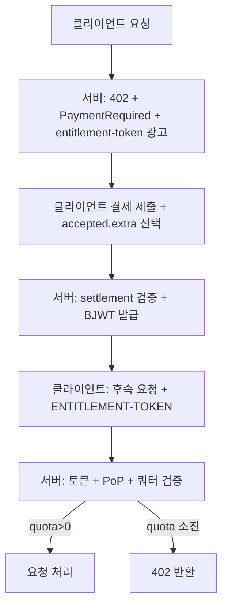

# ACP-402: 선결제형 BJWT Entitlement 토큰으로 후결제 쿼터 접근 제어

## 제안 목적

본 제안은 APIX에서 결제 완료 후 1건의 결제에 대해 정해진 호출 수를 유효화하는 x402 확장안을 제안한다.  
기본 `pay-per-request` 흐름은 유지하면서, `ENTITLEMENT-TOKEN`을 통해 번들형 접근권 모델을 병행 제공한다.

영문 원문: [apiX-402-bjwt-entitlement-token-proposal.md](/home/jylee/omx/APIX/docs/proposals/apiX-402-bjwt-entitlement-token-proposal.md)

## 제안 요약

- **문제**: 현재 APIX의 402 처리 흐름은 결제 후 즉시 단회 사용 흐름에 초점이 있어, 소액 결제 기반의 쿼터 판매 모델이 어렵다.
- **제안**: `ENTITLEMENT-TOKEN + BJWT + PoP proof` 체계를 추가하여, 결제 완료 후 장치 바운드로 재사용 가능한 접근권 토큰을 발급하고 매 호출마다 402 리트리거 없이 다중 호출을 허용한다.
- **적용 범위**: x402 v2의 선택적 확장.
- **도입 영향도**: APIX 백엔드/SDK/데모 프런트 계약 변경 + 영속 스토어 + 재생 공격 방지 + 테스트 강화가 필요하다.

## 제안 요약(요약본)

본 제안은 정착된 x402 흐름 상에 **지갑 바인딩형 BJWT**를 추가해, 결제 정산 후 호출 한도(쿼터)를 부여하는 선택적 확장 규격이다.

`AAT / x402 Entitlement Token`(이하 Entitlement Token)는 발급기관(서버 지갑)이 EIP-191로 서명한 BJWT이며, 클라이언트는 요청 시 주체 지갑으로 서명한 **Proof-of-Possession(증빙 서명)**을 함께 제출한다.

토큰은 N회 호출 한도와 유효 기간을 담아, 매 호출마다 온체인 결제를 요구하지 않고 재사용이 가능하다.

## 배경 및 필요성

pay-per-request 모델은 Web2형 과금 패턴에서 적합하지만, 다음과 같은 API는 선결제형 패키지(쿼터)가 필요하다.

- AI 추론 또는 고가치 API 호출: 1회 결제로 다수 호출을 풀 패키지로 제공
- 버스트 허용형 요금제: 짧은 시간대 집중 호출을 묶음 단위로 판매
- 저지연 Web3 API: 세션형 사용량을 보장하는 액세스권 필요

본 확장은 기존 x402 호환성을 해치지 않으면서 이러한 패턴을 정형화한다.

## 규범 용어

문서의 **MUST**, **MUST NOT**, **REQUIRED**, **SHOULD**, **SHOULD NOT**, **MAY**는 RFC 2119의 정의를 따른다.

## 의사결정자 요약

- **권고안**: 본 확장을 v1으로 채택하되, 기존 `Apix` 세션 토큰 경로는 호환성 유지용으로 함께 운영.
- **MVP 수락 기준**
  - 402 응답에서 `entitlement-token` 광고 정보가 노출되어야 함
  - 결제 완료 후 BJWT 발급 및 `ENTITLEMENT-TOKEN` 재요청 처리 가능해야 함
  - PoP proof와 `(token.jti, proof.jti)` 기반 재생(Replay) 방지 동작 확인
  - 쿼터 소진 시 402로 재도전 유도 동작 완료
  - Positive/negative E2E 테스트 완료
- **v1 범위 외 항목**
  - 온체인 강제 취소/철회 레지스트리 정식 표준화
  - 메시지형이 아닌 토큰 분산키 크로스체인 확장 연동

## 1. 적용 범위

### 포함

- x402 v2 extension hook:
  - `PaymentRequired.extensions["entitlement-token"]`
  - `PaymentPayload.accepted.extra["entitlement-token"]`
  - `SettlementResponse.extensions["entitlement-token"]`
- BJWT 토큰 형식 및 검증
- 요청 시 PoP proof 포함 프레젠테이션
- 서버 사이드에서 쿼터 계산 및 재생 방지

### 미포함

- Avalanche 합의 규칙 변경
- 온체인 강제 철회/폐기 레지스트리 의무화
- x402 정산 구현의 의무화

## 2. 확장 키 및 버전

- 이 확장의 extension key는 `entitlement-token`이다.
- 버전은 문자열 정수 타입으로 반드시 제공되어야 한다.
- 본 문서 초안은 `version: "1"`로 고정한다.
- 상위 호환을 위해 알 수 없는 필드는 무시(SHOULD ignore)할 수 있다.

## 3. 흐름 요약

1. 클라이언트가 보호 리소스를 요청한다.
2. 서버가 HTTP 402와 함께 `PaymentRequired` 및 광고 객체를 반환한다.
3. 클라이언트가 `PaymentPayload.accepted.extra["entitlement-token"]`에 쿼터 패키지를 선택해 결제한다.
4. 서버가 settlement를 검증하고 발급 토큰이 포함된 `SettlementResponse`를 반환한다.
5. 클라이언트는 이후 요청에서 `ENTITLEMENT-TOKEN` 헤더를 사용한다.
6. 서버는 토큰과 proof를 검증하고 사용량을 증가시킨 뒤 소진될 때까지 요청을 처리한다.



## 4. Entitlement 광고 항목

### 4.1 객체: `EntitlementTokenAdvertisement`

```json
{
  "version": "1",
  "domain": "api.example.com",
  "resource": "https://api.example.com/premium-data",
  "tokenFormat": "bjwt",
  "presentationHeader": "ENTITLEMENT-TOKEN",
  "supportedChains": [{ "chainId": "eip155:43114", "proof": "eip191" }],
  "quota": {
    "unit": "call",
    "packOptions": [
      { "uses": 10, "price": { "network": "eip155:43114", "asset": "0xUSDC...", "amount": "10000" },
      { "uses": 100, "price": { "network": "eip155:43114", "asset": "0xUSDC...", "amount": "90000" }
    ]
  },
  "tokenTtlSeconds": 3600,
  "scope": {
    "methods": ["GET", "POST"],
    "paths": ["/premium-data", "/premium-data/*"]
  },
  "features": {
    "pop": true,
    "idempotentProofs": true
  }
}
```

요구사항:

- `version`은 `"1"`이어야 한다.
- `domain`은 보호 리소스의 origin과 일치해야 한다.
- `resource`는 정합적인 리소스 범위를 가리내야 한다.
- v1에서 `tokenFormat`은 `"bjwt"`여야 한다.
- v1에서 `presentationHeader`는 `"ENTITLEMENT-TOKEN"`이어야 한다.
- `supportedChains[].chainId`는 CAIP-2 형식이어야 한다.
- v1에서 `quota.unit`은 `"call"`이어야 한다.
- `quota.packOptions[].uses`는 양의 정수여야 한다.
- `quota.packOptions[].price.amount`는 x402가 사용하는 소수점 문자열 형식이어야 한다.
- `tokenTtlSeconds`는 양의 정수여야 한다.
- `features.pop`가 true일 경우 요청 시 proof가 반드시 있어야 한다.

## 5. 결제 payload의 패키지 선택

### 5.1 객체: `EntitlementPackSelection`

```json
{
  "version": "1",
  "pack": { "unit": "call", "uses": 10 }
}
```

전송 위치:

`PaymentPayload.accepted.extra["entitlement-token"]`

검증 요구사항:

- `version`은 `"1"`이어야 한다.
- `pack.unit`은 v1에서 `"call"`이어야 한다.
- `pack.uses`는 광고된 옵션 중 하나와 일치해야 한다.
- 서버는 결제 정보가 선택한 패키지와 정합되는지 검증해야 한다.

## 6. settlement 응답 내 발급 항목

### 6.1 객체: `EntitlementTokenIssuance`

```json
{
  "version": "1",
  "token": "<BJWT_STRING>",
  "quota": { "unit": "call", "max": 10 },
  "expiresAt": 1760003600
}
```

요구사항:

- `version`은 `"1"`이어야 한다.
- `token`은 유효한 BJWT여야 한다.
- `quota.max`는 선택된 pack의 사용 횟수와 일치해야 한다.
- `expiresAt`은 토큰의 `exp`와 일치해야 한다.

## 7. 토큰 형식: BJWT

BJWT 구성은 다음과 같다:

`base64url(header) . base64url(payload) . base64url(signature)`

### 7.1 Header

```json
{
  "typ": "x402-entitlement+bjwt",
  "alg": "eip191",
  "ver": "1",
  "kid": "eip155:43114:0xISSUER..."
}
```

요구사항:

- `typ`은 `x402-entitlement+bjwt`여야 한다.
- `alg`는 `eip191`이어야 한다.
- `ver`은 `"1"`이어야 한다.
- `kid`는 `{chainId}:{address}` 형태를 권장한다.

### 7.2 Payload

```json
{
  "iss": "eip155:43114:0xISSUER...",
  "sub": "eip155:43114:0xPAYER...",
  "aud": "https://api.example.com",
  "jti": "01H...",
  "iat": 1760000000,
  "exp": 1760003600,
  "scope": {
    "methods": ["GET"],
    "paths": ["/premium-data", "/premium-data/*"]
  },
  "quota": {
    "unit": "call",
    "max": 10
  },
  "x402": {
    "x402Version": 2,
    "network": "eip155:43114",
    "transaction": "0xabc...",
    "payer": "0xPAYER...",
    "payTo": "0xMERCHANT...",
    "asset": "0xUSDC...",
    "amount": "10000",
    "paymentRequirementsHash": "0xREQHASH..."
  }
}
```

요구사항:

- `iss` 및 `sub`는 `{chainId}:{address}`이어야 한다.
- `aud`는 대상 리소스(원점/식별자)를 나타내야 한다.
- `jti`는 전역 고유해야 한다.
- `iat`, `exp`는 UNIX epoch 초 단위 정수여야 한다.
- v1에서 `quota.unit`은 `"call"`이어야 한다.
- `quota.max`는 양의 정수여야 한다.
- `x402.transaction`은 정산 기준 결제 참조값을 식별할 수 있어야 한다.

### 7.3 Signature

`signingInput = base64url(header) + "." + base64url(payload)`  
`message = "x402.entitlement-token.v1:" + signingInput`

- Signature는 `iss`의 발급자 키로 생성한 EIP-191(personal_sign) 서명이어야 한다.
- 검증기는 복구된 서명주소가 `iss`와 일치하는지 확인해야 한다.
- Signature 바이트는 패딩 없는 base64url 인코딩이어야 한다.

### 7.4 결제 제약 바인딩(권장)

`x402.paymentRequirementsHash = keccak256(base64(PAYMENT-REQUIRED JSON))`

요청 컨텍스트가 캐시되어 있는 경우 서버는 위 값을 검증할 수 있다.

## 8. 요청 시 프레젠테이션

### 8.1 객체: `EntitlementPresentation`

```json
{
  "version": "1",
  "token": "<BJWT_STRING>",
  "proof": {
    "type": "eip191",
    "chainId": "eip155:43114",
    "jti": "01J...",
    "iat": 1760000123,
    "htm": "GET",
    "htu": "https://api.example.com/premium-data",
    "ath": "b64url(sha256(token))",
    "requestHash": "0xOPTIONAL",
    "signature": "0x..."
  }
}
```

요청 헤더에는 `ENTITLEMENT-TOKEN`으로 base64 인코딩된 JSON(`EntitlementPresentation`)이 전달된다.

요구사항:

- `version`은 `"1"`이어야 한다.
- `token`은 유효한 BJWT여야 한다.
- 광고에서 `features.pop = true`일 경우 `proof`가 필수다.

### 8.2 Proof 서명

`signature`를 제외한 proof 객체를 RFC 8785(JCS)로 정규화한 뒤 `sub` 지갑이 EIP-191로 서명한다.

`proofMessage = "x402.entitlement-proof.v1:" + JCS(proofWithoutSignature)`

검증 요구사항:

- `proof.signature`가 `sub` 주소로 검증되어야 한다.
- `proof.ath`는 `base64url(sha256(token))`와 동일해야 한다.
- `proof.htm`은 실제 요청 메서드와 일치해야 한다.
- `proof.htu`는 Fragment가 없는 요청 절대 URL이어야 한다.
- `(token.jti, proof.jti)`는 고유해야 한다.
- `proof.iat`는 허용된 시계열 오차 범위 내여야 한다.
- `requestHash`가 존재하면 `method + "\\n" + path + "\\n" + sha256(body)`와 일치해야 한다.

## 9. 서버 처리 절차

`ENTITLEMENT-TOKEN`이 포함된 요청 처리 순서:

1. `EntitlementPresentation` 파싱
2. 토큰 검증
   - 서명 유효성
   - `exp`, `nbf`/`iat` 검증
   - `aud` 일치
   - 범위 확인 (`htm`, `htu`)
3. proof 검증
   - `sub` 서명 검증
   - `ath`, `htu`, `htm`가 요청 문맥과 일치
   - `(token.jti, proof.jti)` 고유성 확인
4. 쿼터 확인
   - `used_count >= quota.max`이면 HTTP 402 반환
5. `used_count` 원자적 증가 후 요청 처리

재생 정책:

- `(token.jti, proof.jti)` 중복은 replay로 처리한다.
- 멱등성 지원이 있는 경우, 동일 proof 재요청은 재사용 응답 캐시를 반환하고 사용량을 다시 증가시키지 않아야 한다.

## 10. 쿼터 소진 및 오류 처리

쿼터 소진 시:

- 서버는 사용 가능한 패키지를 광고하는 새 `PaymentRequired`와 함께 HTTP 402를 반환할 수 있다.
- 선택적으로 `ENTITLEMENT-ERROR` 헤더를 포함할 수 있다.

권장 에러 코드:

- `invalid_token`
- `invalid_proof`
- `expired`
- `scope_violation`
- `quota_exhausted`
- `replay_detected`

## 11. 하위 호환성

본 확장은 선택형 확장이다. 기본 x402 클라이언트/서버는 기존 요청 단위 결제흐름을 유지한다.  
엔드포인트는 엔타이틀먼트가 없는 상태로도 동작 가능하며, 프리미엄 플로우에 한해 선택적으로 쿼터 기반 엔타이틀먼트 지원을 허용한다.

## 12. 기존 초안과의 연계

본 문서는 기존 아이디어를 다음과 같이 통합한다.

- 다중 호출 엔타이틀먼트
- 정산 후 토큰 발급
- 지갑 바인딩+재생 인식 proof
- x402 transport hooks 표준화

## 13. 구현 참고사항

구현 시 다음 항목을 포함한다.

- BJWT 발급/검증 엔진 (ES256K/EIP-191)
- RFC 8785 정규화를 통한 proof 서명
- 원자적 쿼터 저장소 (`used_count`) 및 `(token.jti, proof.jti)` 유니크 인덱스
- 최소 replay 캐시

비규범 예시 코드:

```ts
// Node.js (발급 예시)
import { keccak256, toBytes, toHex } from 'viem'

function computePaymentRequirementsHash(paymentRequiredJson: string): string {
  return keccak256(toBytes(paymentRequiredJson))
}

export function buildBJWTHeader(issuerAddress: string) {
  return { typ: 'x402-entitlement+bjwt', alg: 'eip191', ver: '1', kid: `eip155:43114:${issuerAddress}` }
}
```

```go
// Go (검증 예시)
func VerifyEntitlementToken(token string) error {
  // decode BJWT
  // verify EIP-191 signature against iss address
  // validate iat/exp and scope
  // check used_count < quota.max and unique proof jti
  return nil
}
```

## 보안 고려사항

- 재생 방지: `(token.jti, proof.jti)` 고유성으로 처리
- 토큰 탈취: PoP proof는 주체 지갑 소유 키가 있어야 성립
- Scope 위변조: `htm`/`htu`(필요 시 `requestHash`)로 요청 바인딩
- 중복 결제/재전송: 정산 참조값을 토큰에 바인딩하여 방지
- DoS 대응: 잘못된 토큰/증명은 조기 거절 및 rate-limit 적용
- 키 유출 대비: 발급 지갑 키 순환, 민감 정보 과다 저장 금지

## 열림 질문

1. `ENTITLEMENT-TOKEN`을 전용 헤더와 병행해 `Authorization` scheme으로도 허용할지?
2. `paymentRequirementsHash`를 의무 필드로 강제할지?
3. 온체인 취소/철회 기능을 표준화할지(후속 버전)?
4. v1에서 `call` 이외의 쿼터 단위(bytes, compute_ms 등)를 허용할지?

## 참고 문서

- [x402 Protocol](https://www.x402.org/)
- [RFC 2119](https://www.rfc-editor.org/rfc/rfc2119)
- [RFC 7519 (JWT)](https://datatracker.ietf.org/doc/html/rfc7519)
- [RFC 8785 (JCS)](https://www.rfc-editor.org/rfc/rfc8785)
- [Avalanche C-Chain API](https://docs.avax.network/api-reference/c-chain-api)

## 저작권

저작권 및 관련 권리는 [CC0](https://creativecommons.org/publicdomain/zero/1.0/)로 공개한다.
